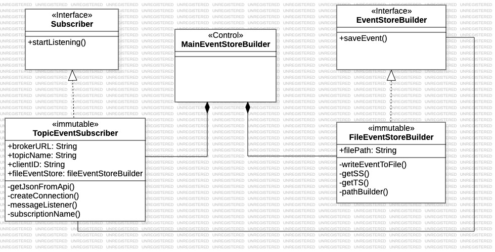

# Event Store Builder
##### Universidad de las Palmas de Gran Canaria
##### Curso 2023/2024
##### Asignatura: Desarrollo de Aplicaciones para Ciencias de Datos
##### Farid Sánchez Belmadi

***

### Summary of functionality

This Java application will systematically store consumed events from a broker in a directory. The events will be stored in the following format, **{YYYYMMDD}.events**,
where **YYYYMMDD** is the year-month-day obtained from the event's timestamp in which the events associated with a specific day are stored and **.events** is the file extension 

****

### Resources used

This program has been developed through a Maven project in the IntelliJ IDEA development environment. Additionally, Git version
control tool and its web repository, GitHub, have been used to ensure the persistence of all modifications made.

As message broker was used ActiveMQ, an open-source message broker that implements the Java Message Service (JMS) API, providing a
reliable and scalable messaging solution. It supports various messaging patterns, including point-to-point and publish/subscribe,
and it enables the exchange of messages between different components in a decoupled manner.

On the following page, you will find the getting started guide and installation documentation for ActiveMQ, https://activemq.apache.org/getting-started

****

### Design

This program only have control-type classes, which implement two interfaces, one for the connection (Subscriber) with the broker and another for the 
storage of events (EventStoreBuilder).
Furthermore, there is a relationship of association between these classes, when the TopicEventSubscriber consumes an event, it invokes the FilerEventStoreBuilder 
to handle the storage process.

### Execution of the program

This program requires 4 arguments for its execution. First, the URL of the broker to which it will connect, then the name of the Topic to which it will subscribe,
the clientID (which will serve to identify our subscriber and allow managing consumed messages or those yet to be consumed in case of disconnection), and finally,
the path where the 'event' folder will be stored.

To run this program, access the terminal of your operating system, then navigate to the folder where the JAR is located, and finally, enter the following
command: **java -jar YourApp.jar arg1 arg2 arg3**.

### Class diagram

