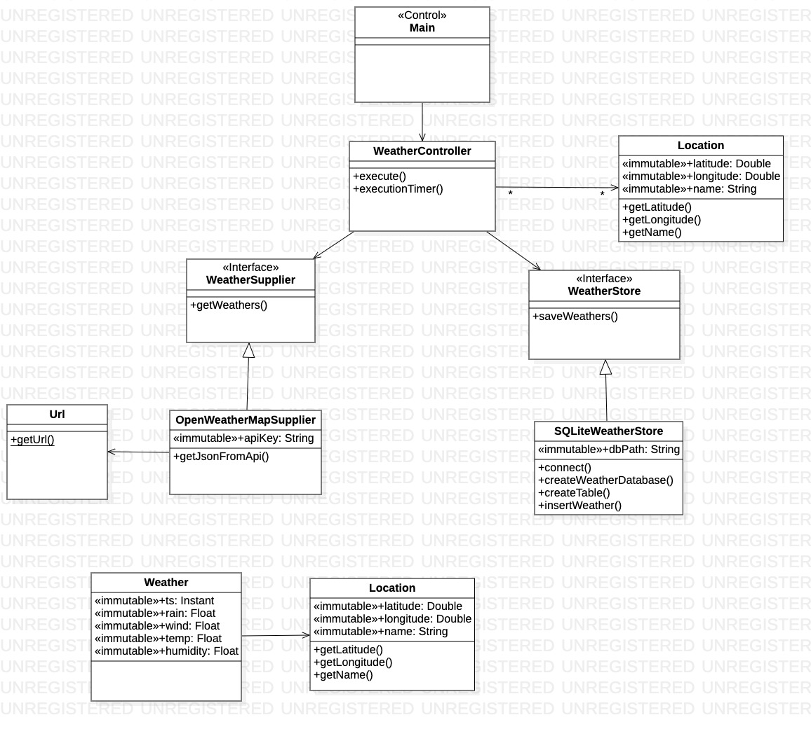

# Practica 1: Captura de datos de Open Weather Map
##### Universidad de las Palmas de Gran Canaria
##### Curso 2023/2024
##### Asignatura: Desarrollo de Aplicaciones para Ciencias de Datos
##### Farid Sánchez Belmadi

***

### Resumen de la funcionalidad.

Esta aplicación Java tiene como función la recopilación de datos meteorológicos predictivos para las 8 islas Canarias. Para ello 
se ha utilizado una API REST de Open Weather Map, la cual nos permite obtener los datos predictivos de los proximos 4 días desde cuando
 se realiza la consulta, en intervalos de 3 horas. En este caso solo se han escogido aquellas predicciones correspondientes a las 12 PM.
Estos datos se almacenan en una base de datos Sqlite y se van actualizado en caso de haber modificaciones para las mismas fechas en las proximas
capturas.

Los datos meteorologicos predictivos están compuestos por la temperatura (en grados Celsius), la probabilidad de precipitaciones, 
el porcentaje de humedad, el procentaje de nubes y la velocidad del viento. El formato utilizado para manejar estas variables ha sido
el "Float" pues la precisión de decimales que nos ofrece este formato es más que suficiente para trabajar con porcentajes, así como
también es más eficiente a la hora de almacenar puesto que ocupa menos espacio.

Con respecto a la localización, se ha escogido las latitudes y longitudes de las capitales de cada isla. En este caso, como la cantidad
de decimales es mucho mayor puesto que se necasita una mayor presición, se ha utilizado el formato "Double".

***

### Recursos utilizados

Este programa ha sido desarrollado a través de un proyecto Maven, en el entorno de desarrollo intellij IDEA con el JDK 17 de Java.
Además se ha utilizado la herramienta de control de versiones Git y su repositorio web, GitHub, con el fin de garantizar la peristencia
de todas las modificaciones realizadas. 

Cabe destacar el uso de la dependencia **sqlite-jdbc** para gestionar la conexión con la base de datos Sqlite, **httpclient** para 
establecer la conexión con la API de Open Weather Map y **json** para poder acceder a la cadena de caracteres serializada en formato
JSON y extraer la información que necesitamos.

****

### Diseño

En este programa se ha aplicado el patrón modelo-control. Por un lado, en el modelo se definien las clases Weather y Location, entre
las cuales existen una asociación pues la clase Weather tiene un atributo de tipo Location. 
Por otro lado, en el control se definen todas aquellas clases e interfaces que realizan operaciones sobre el modelo. En este caso, 
se definen dos interfaces, una para la extracción de información de la API REST de Open Weather Map (WeatherSupplier) y otra para el
almacenamiento en la base de datos Sqlite (WeatherStore). El WeatherController es el nexo de unión entre estas dos interfaces y además les 
provee la información necesaria para que puedan funcionar, una lista de localizaciones y otra con elementos de tipo Instant (que indican
la fecha y hora para la cual se solicita los datos de predicción).

### Diagrama de clases

