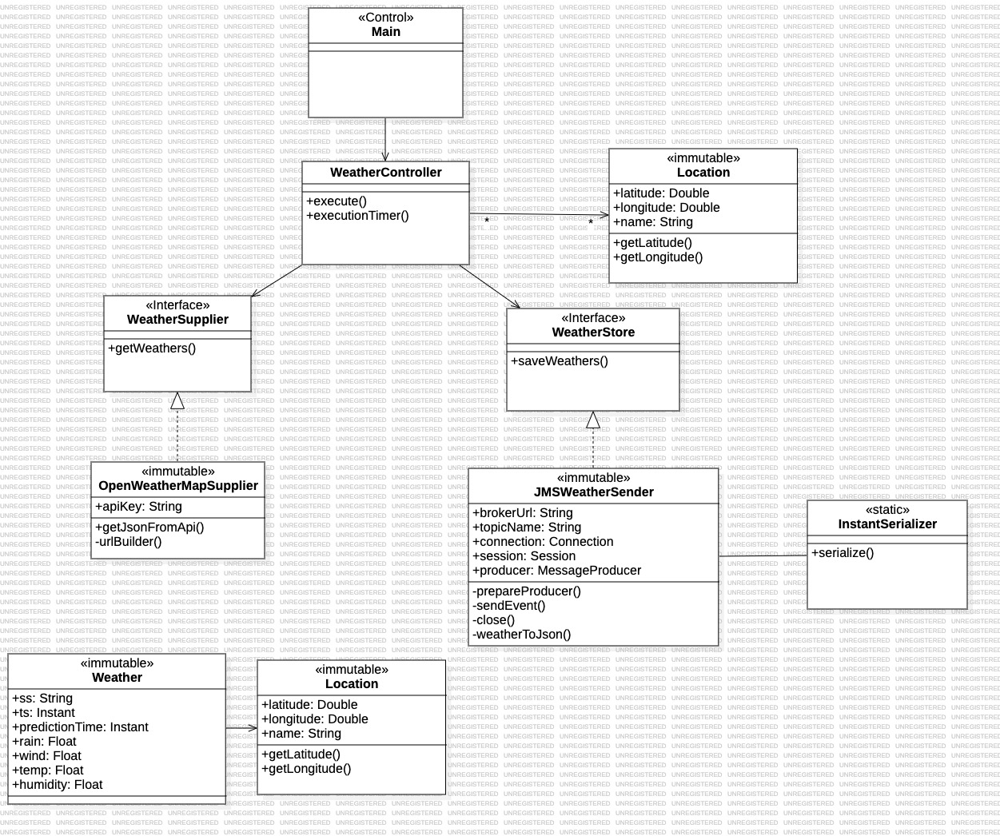

# Weather Provider
##### Universidad de las Palmas de Gran Canaria
##### Curso 2023/2024
##### Asignatura: Desarrollo de Aplicaciones para Ciencias de Datos
##### Farid Sánchez Belmadi

***

### Summary of functionality

This Java application is designed to collect predictive weather data for the 8 Canary Islands every 6 hours. To achieve this, an 
Open Weather Map REST API has been utilized, allowing us to retrieve predictive data for the next 4 days from the time
of the query, at 3-hour intervals. In this case, only predictions corresponding to 12 PM have been selected.

Once the predictions are obtained, they will be serialized in JSON format and sent to a message broker, also known as 
an intermediary, which enables applications, systems, and services to communicate and exchange information. In this project, 
a Publish/Subscribe messaging pattern is used, a message distribution pattern where the producer of each message publishes it 
to a topic, and various message consumers subscribe to topics from which they want to receive messages. Therefore, all messages 
published on a topic are distributed to all subscribed applications. It is a broadcast-type distribution method, where there is a 
one-to-many relationship between the message publisher and its consumers.

The predictive weather data consists of temperature (in degrees Celsius), probability of precipitation, humidity percentage, 
cloud percentage, and wind speed. The format used to handle these variables is "Float" because the decimal precision offered by 
this format is more than sufficient for working with percentages. Additionally, it is more efficient in terms of storage as it 
occupies less space.

Regarding the location, the latitudes and longitudes of the capitals of each island have been chosen. In this case, since a greater 
precision is needed, the "Double" format has been used, as it allows for a much higher number of decimal places.

****

### Resources used

This program has been developed through a Maven project in the IntelliJ IDEA development environment. Additionally, Git version 
control tool and its web repository, GitHub, have been used to ensure the persistence of all modifications made.

As message broker was used ActiveMQ, an open-source message broker that implements the Java Message Service (JMS) API, providing a 
reliable and scalable messaging solution. It supports various messaging patterns, including point-to-point and publish/subscribe, 
and it enables the exchange of messages between different components in a decoupled manner.

On the following page, you will find the getting started guide and installation documentation for ActiveMQ, https://activemq.apache.org/getting-started

****

### Design

In this program, the model-view-controller (MVC) pattern has been applied. On one hand, in the model, the classes Weather and Location 
are defined, and there is an association between them as the Weather class has an attribute of type Location.

On the other hand, in the controller, all classes and interfaces that perform operations on the model are defined. In this case, two interfaces 
are defined—one for extracting information from the Open Weather Map REST API (WeatherSupplier) and another for sending events to the broker 
(JMSWeatherSender). The WeatherController serves as the link between these two interfaces and provides them with the necessary information to function, 
including a list of locations and another with elements of type Instant (indicating the date and time for which prediction data is requested).

### Execution of the program

This program requires 3 arguments for its execution. Firstly, the API key to connect to the OpenWeatherMap API and obtain meteorological data, 
the URL of the broker to which it will connect and finally, the name of the topic to which you will send the events.

To run this program, access the terminal of your operating system, then navigate to the folder where the JAR is located, and finally, enter the following
command: **java -jar YourApp.jar arg1 arg2 arg3**.

### Class diagram

